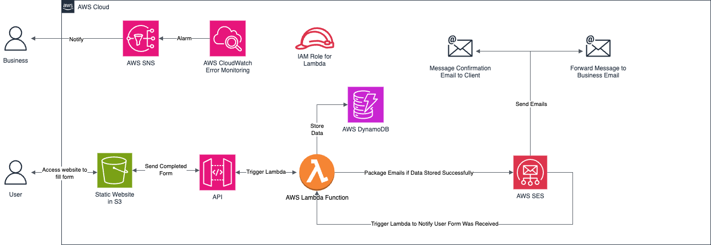

# AWS Serverless Contact Form Project

## Deliverables: 

Access my detailed breakdown on Medium [here](https://medium.com/@gurniksingh/project-building-a-robust-serverless-contact-form-for-premier-mortgage-solutions-b760ac2b501e)

Contact Form Architecture:


----------------------------------------------------------------

## Project Details 

This repository contains the code and infrastructure definition for a highly scalable, cost-effective, and robust serverless contact form solution. Designed initially for Premier Mortgage Solutions, this project demonstrates a modern approach to customer inquiry management using a suite of AWS services orchestrated by Terraform.

The solution automates customer communication, securely stores inquiry data, and provides proactive error monitoring, replacing traditional, inefficient ```mailto``` links with a professional and reliable system.

**Key Technologies:**

- **Frontend:** HTML, CSS, JavaScript
- **Backend:** AWS Lambda (Node.js)
- **Database:** AWS DynamoDB
- **Email Service:** AWS SES (Simple Email Service)
- **API Gateway:** AWS API Gateway
- **Static Hosting:** AWS S3
- **Monitoring & Alerting:** AWS CloudWatch, AWS SNS (Simple Notification Service)
- **Infrastructure as Code (IaC):** Terraform

----------------------------------------------------------------

## Prerequisites

Before you begin, ensure you have the following installed, configured, and activated:

1. Git: For cloning the repository.
- [Download & Install Git](https://github.com/git-guides/install-git)

2. Node.js & npm: Required for the Lambda function's dependencies.
- [Download & Install Node.js](https://nodejs.org/en/download) (npm is included)

3. AWS CLI: For configuring your AWS credentials.
- [Install & Configure AWS CLI](https://docs.aws.amazon.com/cli/latest/userguide/getting-started-install.html)

4. Ensure your AWS CLI is configured with credentials that have sufficient permissions to create and manage the AWS resources (S3, API Gateway, Lambda, DynamoDB, SES, SNS, CloudWatch, IAM roles/policies).

5. Terraform CLI: To provision and manage your AWS infrastructure.
- [Download & Install Terraform](https://developer.hashicorp.com/terraform/install)

----------------------------------------------------------------

## AWS Service-Specific Activations:

**SES Email Identity Verification:**

- To allow your Lambda function to send emails, the sender email address (or domain) must be verified in Amazon SES.

- Navigate to the AWS SES Console > Verified identities (or Email addresses / Domains).

- Add your desired sender email and follow the verification steps (clicking a link in an email).

**SNS Topic Subscription Confirmation:**

- For CloudWatch alarms to send error notifications via SNS, the email address subscribed to the SNS topic must be confirmed.

- After Terraform deployment creates the SNS topic and subscription (which uses the email defined in ```variables.tf```), you will receive a "AWS Notification Message" email.

- Crucially, open this email and click the "Confirm subscription" link. Without this confirmation, you will not receive alerts.

----------------------------------------------------------------

## Quick Start Guide

Ready to get this project running quickly? Follow these steps:

1. **Clone the Repository:** 

- Clone this GitHub repository to your local machine using ```git clone```.

2. **Prepare Lambda Function Code:** 

- Navigate into the ```lambda``` directory
- Install Node.js dependencies with ```npm install```
- Terraform will then zip this directory on deployment.

3. **Initialize Terraform:**

- Navigate to your Terraform configuration directory (e.g., ```terraform``` if you have it structured that way, otherwise stay at root if ```main.tf``` is there)
- Initialize Terraform with ```terraform init```

4. **Review and Customize Variables:**

- Open ```variables.tf``` (and ```main.tf``` if necessary) to review and adjust parameters such as:

    - ```aws_region```
    - ```aws_ses_email_identity``` (must be your verified SES email)
    - ```aws_sns_topic_subscription``` (the email to receive Lambda error alerts)
    - Other names or tags to match your preferences.

5. **Deploy Infrastructure:**

- Run ```terraform plan``` to preview what Terraform will provision before applying.
- Apply the Terraform configuration using ```terraform apply``` to provision infrastructure.
- Review the proposed changes and type ```yes``` when prompted to confirm the deployment. 
- S3 website endpoint and API Gateway URL will output upon successful completion.

6. **Configure Frontend with API Gateway URL:**

- Retrieve the ```api-gateway-url``` from your Terraform outputs (or directly from the AWS API Gateway console).
- Open the ```script.js``` file and replace the empty ```apiGatewayUrl``` with the actual URL.

7. **Redeploy Changes with Terraform**
- Run ```terraform plan``` to see the proposed changes (Terraform will detect changes in local files to deploy them).
- Run ```terraform apply``` to apply the changes

8. **Verify Deployment:**

- Once the S3 website is deployed, access your contact form using the ```s3-bucket-website-endpoint``` URL from your Terraform outputs.
- Fill out the form and submit it.
- Verify:
    - The on-screen success message.
    - The confirmation email received by the "client" (your test email).
    - The inquiry notification email received by the "business owner" (your specified email for alerts/inquiries).
    - Check CloudWatch logs for the Lambda function for successful execution records.

----------------------------------------------------------------

## Cleanup: Destroying Resources

Once you are finished experimenting with the project, you can destroy all the AWS resources provisioned by Terraform to avoid incurring unnecessary costs.

*Caution: This action is irreversible and will delete all resources, including your DynamoDB table data and S3 bucket contents.*

1. **Navigate to your Terraform directory**
- ```cd terraform```

2. **Run Terraform Destroy:**
- ```terraform destroy```

3. **Confirm Destruction:** 
- Review the list of resources that will be destroyed and type ```yes``` when prompted to confirm.